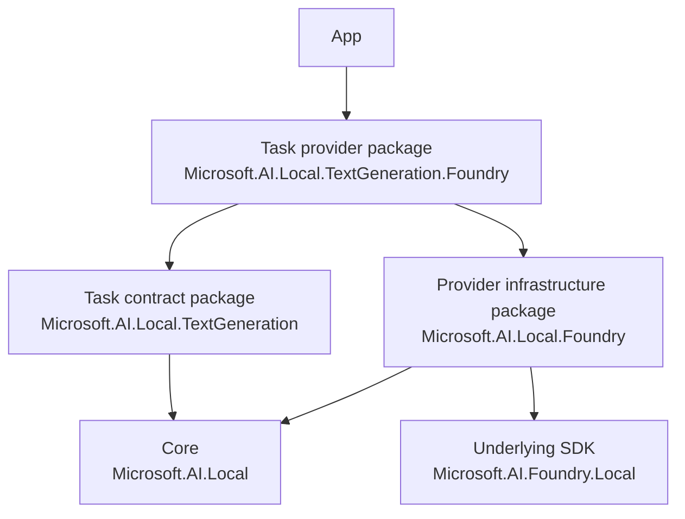

# Architecture

This document explains how the repository is put together: what each package does, how a model handle like `LanguageModels.Phi4Mini` finds its implementation, and what to touch when you add something. For the design rationale, see [PROPOSAL.md](PROPOSAL.md).

## The big picture

Apps write code against **tasks** (text generation, OCR, ...), not against providers. The model handle is the only provider-specific line:

```csharp
ITextGenerationModel model = LanguageModels.Phi4Mini;   // or LanguageModels.PhiSilica
await model.EnsureReadyAsync();
using IChatClient chat = await model.CreateClientAsync();
```

To make that work, the code is split into four kinds of packages:



| Kind | Example | What's in it | Depends on |
|---|---|---|---|
| **Core** | `Microsoft.AI.Local` | Everything every task shares: `ILocalModel` (availability, download progress, `EnsureReadyAsync`), `ImageFrame`, errors, `LocalModel.SelectFirstAvailableAsync`, and the model catalog. Also ships the build-time generator and analyzers. | Only `Microsoft.Extensions.*.Abstractions` |
| **Task contract** (11) | `Microsoft.AI.Local.TextGeneration` | One task's API: model interface (`ITextGenerationModel`), client contract, options and results, the catalog class (`LanguageModels`), and DI helpers. | Core |
| **Provider infrastructure** (2) | `Microsoft.AI.Local.Foundry`, `Microsoft.AI.Local.Windows` | Plumbing shared by all of a provider's tasks: the Foundry Local runtime, the Phi Silica unlock, identity checks, options, and base classes. **No models.** | Core and the provider's SDK |
| **Task provider** (9 Windows + 3 Foundry) | `Microsoft.AI.Local.TextGeneration.Foundry` | The models of one task from one provider. | Its task contract and its provider infrastructure |

Why split this way:

- **By task**, so each task's API can version independently. A breaking change in text generation doesn't touch OCR.
- **By provider**, so an app only carries the dependencies of the models it uses. An inbox-only OCR app never gets ONNX Runtime or the text-generation API.

Task packages share only the core. Even cross-task helpers follow that rule: `AsTextSummarizationModel()` takes the core type `ILocalModel<IChatClient>`, so the summarization package doesn't depend on the text-generation package.

## How a model handle finds its implementation

A handle lives in a **task** package, but its implementation lives in a **provider** package the app may not reference. Four steps connect them:

```
 eng/catalog/foundry-models.json ──(build: catalog generator)──►  LanguageModels.Phi4Mini       (in the task package)
                                 └─(build: catalog generator)──►  FoundryTextGenerationRegistration (in the provider package)

 App build ──(provider-registration generator)──► module initializer that calls FoundryTextGenerationRegistration.Register()

 App runs ──► LanguageModels.Phi4Mini asks LocalModelCatalog for "foundry/phi-4-mini" ──► the Foundry handle (or a placeholder)
```

1. **Manifests list the models.** Each provider has a checked-in manifest in [eng/catalog](eng/catalog) (`windows-models.json`, `foundry-models.json`). Each entry has the model's alias, task, catalog property name, capabilities and platforms.
2. **The catalog generator writes both sides.** [Microsoft.AI.Local.Catalog.Generators](src/Microsoft.AI.Local.Catalog.Generators) runs while the packages build:
   - In a **task package**, it emits the catalog class (`LanguageModels.PhiSilica`, `LanguageModels.Phi4Mini`, ...) from *all* manifests. Each property is tagged `[RequiresLocalModelProvider("<package>")]`.
   - In a **task provider package**, it emits that provider's descriptors for that task, plus a `<Provider><Task>Registration` class and an `[assembly: LocalModelProvider(...)]` attribute.

   The handle and the implementation are generated from the same manifest entry, so their IDs and capabilities always match.
3. **The app registers its providers automatically.** The provider-registration generator ships inside the core package and runs in the *app's* build. It finds the `[assembly: LocalModelProvider]` attributes on the app's references and emits a module initializer that calls each `Register()`. There's no reflection, so trimming and Native AOT keep working.
4. **The handle binds at run time.** When the app touches `LanguageModels.Phi4Mini`, the generated property asks `LocalModelCatalog` for `foundry/phi-4-mini`:
   - **Registered:** the property returns the provider's real handle.
   - **Not registered:** the property returns a placeholder that reports `MissingAppRequirement` ("add package X"). The placeholder never throws from the handle itself, so `SelectFirstAvailableAsync` can move on to the next model.

**Safety net at build time:** analyzer `MSAILOCAL201` warns at each use of a handle whose provider package the app doesn't reference. It only checks executables, because libraries may leave the choice of provider to the app.

## What a provider package implements

The generator writes the descriptors and the registration code. The provider package itself writes only two things:

- A `<Provider>ModelFactory.Create(LocalModelDescriptor)` method that the generated registration calls.
- The model and client classes, built on the base classes in the infrastructure package.

| Provider | Base class to derive from | Notes |
|---|---|---|
| Windows | `WindowsModelBase<TClient>` (or `WindowsLanguageModelBase<TClient>` for models that run on Phi Silica) | Implement the native ready check, the native `EnsureReadyAsync`, and client creation. Put that code in `*.Windows.cs` files. A `*.Portable.cs` factory returns `WindowsUnsupportedModel<TClient>` for the `net8.0` build, which reports `NotSupportedOnPlatform`. |
| Foundry | `FoundryModelHandle<TClient>` | Implement `CreateClient(variant, lease)`. Initialization, execution-provider and model download, loading, `WithDevice`, and unloading are inherited. |

All providers end up on `LocalModelBase<TClient>` in the core. It provides the behavior every model shares: concurrent `EnsureReadyAsync` calls are merged into one download, cancellation is reference-counted across callers, progress is normalized, and logging and telemetry are built in.

## Build conventions: the project name drives everything

Task and provider projects are almost empty. Their `.csproj` holds only a description. [src/Directory.Build.props](src/Directory.Build.props) reads the project name, and [src/Directory.Build.targets](src/Directory.Build.targets) uses it to set up the build:

| Project name | Becomes | Gets automatically |
|---|---|---|
| `Microsoft.AI.Local.<Task>` | Task contract package | A reference to the core, the catalog generator in catalog mode, and the shared helpers it needs from [src/Shared](src/Shared) |
| `Microsoft.AI.Local.<Task>.<Provider>` | Task provider package | References to its task package and provider infrastructure package, the catalog generator in provider mode, and the provider's target frameworks (Windows packages also build for `net8.0`) |

[src/Shared](src/Shared) holds internal helpers, such as the lazy clients and the chat-backed adapters. They are compiled *into* each task package that needs them, instead of being a shared package, so the task packages stay independent.

Versions are in [eng/Versions.props](eng/Versions.props), one version per task family. A task contract package and its provider packages always share a version.

## Common changes

**Add a model:** add an entry to the provider's manifest in [eng/catalog](eng/catalog). The task's catalog class and the provider's descriptors pick it up on the next build. If the provider package needs model-specific behavior, handle it in its `<Provider>ModelFactory.Create`.

**Add a provider for an existing task** (for example, Windows speech-to-text):
1. Add the models to that provider's manifest.
2. Create `src/Microsoft.AI.Local.SpeechToText.Windows/` with a `.csproj` (description only) and a `WindowsModelFactory` plus model classes.
3. Add the project to [Microsoft.AI.Local.slnx](Microsoft.AI.Local.slnx).

**Add a task:**
1. Create `src/Microsoft.AI.Local.<Task>/` with the model interface, the client contract and an empty `public static partial class <Task>Models`.
2. Add the task's name to `LocalAITasks` in [src/Directory.Build.props](src/Directory.Build.props), to `CatalogTask.All` in [CatalogManifest.cs](src/Microsoft.AI.Local.Catalog.Generators/CatalogManifest.cs), and to [eng/Versions.props](eng/Versions.props).
3. If the task needs any of the [src/Shared](src/Shared) helpers, add it to the matching condition in [src/Directory.Build.targets](src/Directory.Build.targets).

**Add a provider** (a new runtime):
1. Create a manifest `eng/catalog/<provider>-models.json`.
2. Create an infrastructure package `Microsoft.AI.Local.<Provider>` with its base classes.
3. Create task provider packages `Microsoft.AI.Local.<Task>.<Provider>`.

## Repository map

```
src/
  Microsoft.AI.Local/                     core
  Microsoft.AI.Local.<Task>/              task contract packages (11)
  Microsoft.AI.Local.<Task>.Windows/      Windows task providers (9)
  Microsoft.AI.Local.<Task>.Foundry/      Foundry task providers (3)
  Microsoft.AI.Local.Windows/             Windows provider infrastructure
  Microsoft.AI.Local.Foundry/             Foundry provider infrastructure
  Microsoft.AI.Local.Analyzers/           provider-registration generator + analyzers (shipped inside the core)
  Microsoft.AI.Local.Catalog.Generators/  catalog generator (build-time only, not shipped)
  Shared/                                 internal helpers compiled into task packages
eng/
  catalog/<provider>-models.json          the model lists
  Versions.props                          one version per task family
tests/
  Microsoft.AI.Local.Tests/               runs like an app: catalog binding, registration, placeholders
  Microsoft.AI.Local.Analyzers.Tests/     generator and analyzer tests on in-memory compilations
pack.ps1                                  builds all 26 packages into artifacts/packages
```

## Build, test, pack

```powershell
dotnet build Microsoft.AI.Local.slnx
dotnet test Microsoft.AI.Local.slnx
.\pack.ps1 -VersionSuffix local.1        # local NuGet feed in artifacts\packages
```
